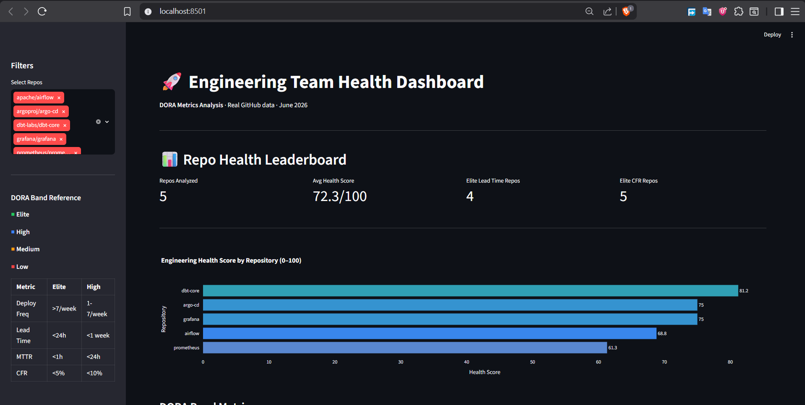
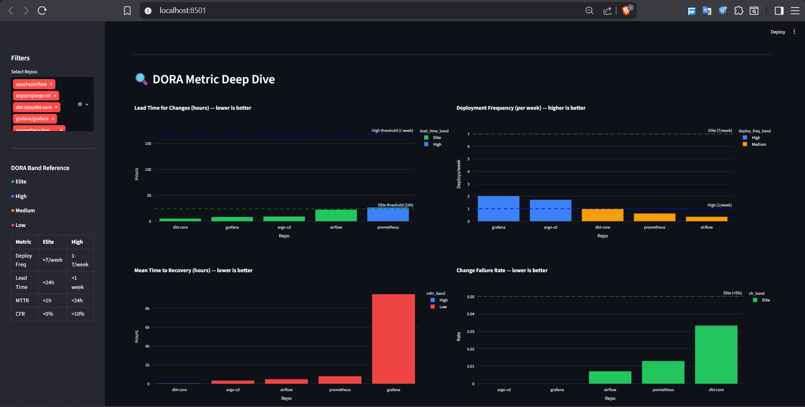
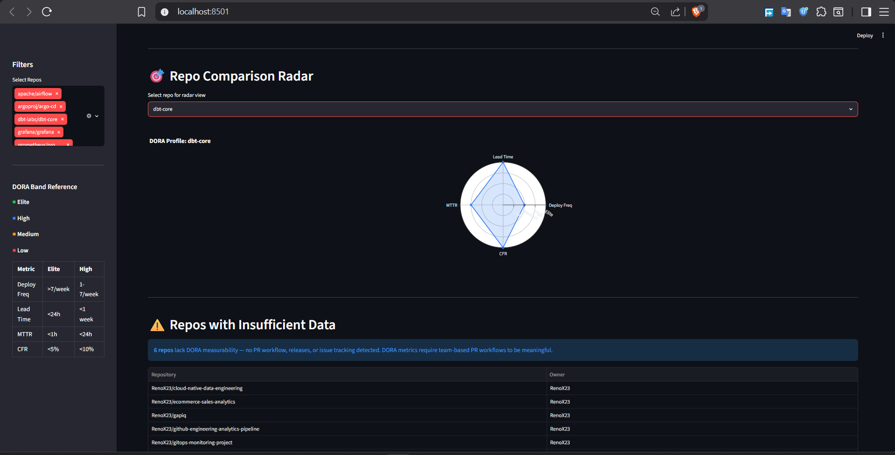
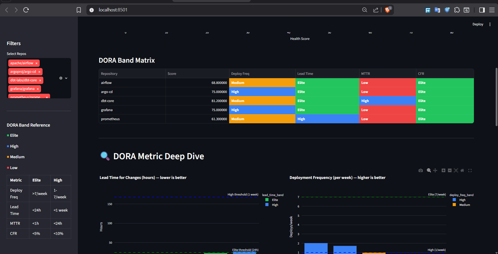

# DORA Metrics Dashboard

> Real-time engineering team health analytics dashboard.
> Pulls live GitHub data from 5 public engineering orgs,
> calculates DORA metrics (deployment frequency, lead time, MTTR, CFR),
> and visualizes team health scores with interactive Streamlit dashboard.

**Live Dashboard:** https://renox23-dora-metrics-dashboard.streamlit.app/

## Key Insights

- **dbt-labs/dbt-core leads** — 81.2/100 health score (Elite lead time <5h, High MTTR)
- **Argo CD is most agile** — 1.72 deploys/week (High band), 9h lead time (Elite)
- **Grafana deploys fastest** — 2.02/week but 9,492h MTTR (ops issues take months)
- **Elite lead time across board** — all 5 orgs <26h from commit → merge
- **Personal repos unmeasurable** — 6 solo projects score 0/100 (no PR workflow, no releases)

## DORA Framework

DORA (DevOps Research & Assessment) measures software delivery performance:

| Metric | What | Elite | High | Medium | Low |
|--------|------|-------|------|--------|-----|
| **Deployment Frequency** | Releases/week | >7 | 1-7 | 1/mo | <1/mo |
| **Lead Time for Changes** | Commit→merge (hrs) | <24 | <168 | <720 | >720 |
| **MTTR** | Bug issue resolution (hrs) | <1 | <24 | <168 | >168 |
| **Change Failure Rate** | Reverts / total merged PRs | <5% | <10% | <15% | >15% |

Health Score = weighted composite (Deploy Freq 25%, Lead Time 30%, MTTR 25%, CFR 20%)

## Tech Stack

| Layer | Tool |
|-------|------|
| Data Collection | Python, PyGithub, GitHub REST API |
| Storage | SQLite |
| Processing | Python (pandas) |
| Dashboard | Streamlit + Plotly |
| Deployment | Streamlit Cloud |
| Version Control | Git, GitHub |

## Project Structure

```
dora-metrics-dashboard/
├── collector/
│   ├── github_collector.py  # API → SQLite (1000 PRs, 250 releases, 1000 issues)
│   └── dora_calculator.py   # DORA metric calculations + health score
├── dashboard/
│   └── app.py               # Streamlit dashboard (3 pages, 10+ visuals)
├── data/
│   ├── dora.db              # SQLite database
│   └── dora_metrics.csv     # Metrics export
├── requirements.txt
└── README.md
```

## How It Works

1. **GitHub API Scrape** — Fetch PRs, releases, issues from 5 public orgs
2. **DORA Calculations** — Per-repo metrics (deploy freq, lead time, MTTR, CFR)
3. **Health Scoring** — Weighted band assignment (Elite/High/Medium/Low)
4. **Interactive Dashboard** — Filter, compare, radar view

## Data Coverage

| Org | PRs | Releases | Issues | Health Score |
|-----|-----|----------|--------|--------------|
| dbt-labs/dbt-core | 200 | 50 | 200 | 81.2/100 |
| argoproj/argo-cd | 200 | 50 | 200 | 75.0/100 |
| grafana/grafana | 200 | 50 | 200 | 75.0/100 |
| apache/airflow | 200 | 50 | 200 | 68.8/100 |
| prometheus/prometheus | 200 | 50 | 200 | 61.3/100 |

Personal repos (6) = insufficient data (no PR workflow).

## Dashboard Features

## Dashboard Screenshots
**Page 1 — Leaderboard**
- Health score rankings
- DORA band matrix (Elite/High/Medium/Low color-coded)
- KPI cards (repos analyzed, avg health, elite repos)
### Leaderboard


**Page 2 — DORA Deep Dive**
- 4 metric charts: deployment frequency, lead time, MTTR, CFR
- Reference thresholds (Elite/High bands) as dashed lines
- Per-repo breakdown

### DORA Deep Dive


**Page 3 — Radar + Comparison**
- Repo selection dropdown
- Radar chart (4D DORA profile)
- Insufficient data flagging


### Radar Profile


**Filters & References**
- Multi-select repo filter
- DORA band thresholds sidebar
- Category tagging (your repos vs public orgs)

### Insufficient Data



---
